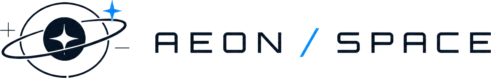

# 🚀 AEON / SPACE

<div align="center">



A cinematic, content-driven space agency website template built with **Astro 6**, **React 19**, **Tailwind CSS 4**, and **Framer Motion**. Designed for editorial space brands, science-forward landing pages, fictional agencies, mission archives, launches, and immersive narrative sites.

[](https://opensource.org/licenses/MIT)
[](https://astro.build)
[](https://tailwindcss.com)
[](https://react.dev)
[](https://www.typescriptlang.org/)
[](https://motion.dev)

</div>

## Current State

AEON / SPACE is currently a polished Astro template with a responsive home page, typed markdown collections, light/dark mode, theme-aware brand assets, animated statistics, live launch countdowns, and archive/detail pages for missions, reports, news, and departures.

Recent UI state includes:

- Theme-aware AEON wordmark and symbol assets in `public/brand/`
- Full-bleed cinematic hero with animated star field, angled desktop navigation, mobile menu, and branded center symbol
- Sticky glassmorphism header on subpages that hides on downward scroll and reveals on upward scroll
- Light/dark theme toggle with persisted user preference
- Animated count-up stats section
- Mission, report, departure, and news collection pages
- Markdown-powered detail pages with Astro Content Collections
- Responsive desktop, tablet, and mobile layouts
- Hover and motion polish for CTAs, archive links, departure rows, and mission cards
- Footer updated with the full AEON / SPACE wordmark

## ✨ Features

- ⚡ **Astro 6 + TypeScript** - Static-first site with typed content schemas
- ⚛️ **React islands** - Interactive hero, theme toggle, countdown, motion sections, and animated stats
- 🎨 **Tailwind CSS 4** - Custom theme tokens and light/dark design variables in `src/styles/global.css`
- 🎬 **Framer Motion** - Hero entrance animation, section reveals, menu motion, count-up triggers, and hover affordances
- 📝 **Astro Content Collections** - Validated markdown content for all editorial areas
- 📱 **Responsive Navigation** - Angled desktop hero nav, mobile drawer on home, compact menu on subpages
- 🪐 **Theme-Aware Branding** - Wordmark and symbol variants for dark and light contexts
- ⏱️ **Launch Countdown** - Live countdown based on departure frontmatter dates and times
- 📰 **Editorial Detail Layouts** - Dedicated layouts for reports, missions, news, departures, and singleton pages
- 🖼️ **Static Assets** - Local image model for replacing agency visuals quickly

## 🚀 Quick Start

### 📌 Prerequisites

- Node.js `>= 22.12.0`
- npm

### 📦 Installation

```bash
# Clone the repository
git clone <your-repository-url>

# Navigate to the project directory
cd aeon-space-agency

# Install dependencies
npm install

# Start the development server
npm run dev
```

Visit `http://localhost:4321` to view the site.

## 📋 Commands

All commands are run from the root of the project:

| Command | Action |
| :--- | :--- |
| `npm install` | Install dependencies |
| `npm run dev` | Start dev server at `localhost:4321` |
| `npm run build` | Build production site to `./dist/` |
| `npm run preview` | Preview the production build locally |
| `npm run check` | Run Astro checks |
| `npm run astro ...` | Run Astro CLI commands |

## 🧰 Tech Stack

| Area | Tooling |
| :--- | :--- |
| Framework | Astro 6 |
| UI Islands | React 19 |
| Styling | Tailwind CSS 4 |
| Motion | Framer Motion 12 |
| Icons | Lucide React |
| Content | Astro Content Collections |
| Image Processing | Sharp |
| Language | TypeScript |

## 📂 Project Structure

```text
aeon-space-agency/
├── public/
│   ├── brand/                 # Theme-aware AEON logo and symbol PNGs
│   ├── images/                # Site imagery used by content/frontmatter
│   └── images-src/            # Source SVG illustrations
├── src/
│   ├── components/            # React islands and reusable UI sections
│   │   ├── BrandLogo.tsx      # Theme-aware logo/symbol renderer
│   │   ├── HeroShell.tsx      # Home hero, mobile nav, angled desktop nav
│   │   ├── StatsSection.tsx   # Count-up stats
│   │   ├── LaunchCountdown.tsx
│   │   └── ThemeToggle.tsx
│   ├── content/               # Markdown content collections
│   │   ├── departures/
│   │   ├── missions/
│   │   ├── news/
│   │   ├── pages/
│   │   └── reports/
│   ├── layouts/               # Shared page and entry layouts
│   ├── lib/                   # Content mapping and formatting utilities
│   ├── pages/                 # File-based routes
│   ├── styles/
│   │   └── global.css         # Tailwind import, tokens, theme overrides
│   └── content.config.ts      # Astro content schemas
├── astro.config.mjs
├── package.json
├── tsconfig.json
└── README.md
```

## Site Areas

### 🏠 Home Page

The home page is assembled in `src/pages/index.astro` and currently includes:

- `HeroShell` - full-screen hero, star field, AEON logo, mobile menu, angled nav, CTAs
- `MissionsSection` - active mission preview cards
- `DiscoverySection` - latest report feature and spectral analysis chart
- `StatsSection` - animated metrics that count from zero when visible
- `DepartureSection` - next departure, launch image, live countdown, launch rows
- `FooterSection` - directory, coordinates, policies, and AEON wordmark

### 🗄️ Collection Pages

Collection indexes are generated from markdown content:

- `/missions/`
- `/reports/`
- `/news/`
- `/departures/`

Each collection also has generated detail routes.

### 📄 Singleton Pages

Standalone agency pages live in `src/content/pages/`:

- `/about/`
- `/science/`
- `/technology/`

## 📝 Content Management

All primary content is file-based and stored in `src/content/`. Content is validated by `src/content.config.ts`, so missing or invalid fields surface during development/build.

### 🛰️ Missions

Path: `src/content/missions/`

Important frontmatter:

- `title`
- `summary`
- `status`
- `statusTone` - `green`, `blue`, or `gold`
- `icon` - `satellite`, `rocket`, or `star`
- `order`
- `vehicle`
- `missionWindow`
- `destination`
- `coverImage`

### 🔭 Reports

Path: `src/content/reports/`

Important frontmatter:

- `title`
- `summary`
- `label`
- `publishedAt`
- `image`
- `spectrumBars` - exactly 12 values from `0` to `100`
- `rangeStart`
- `rangeEnd`
- `highlight`

### 🚀 Departures

Path: `src/content/departures/`

Important frontmatter:

- `title`
- `detail`
- `launchDate`
- `launchTime` - `HH:mm` or `HH:mm:ss`
- `image`
- `launchSite`
- `missionWindow`
- `order`

### 📰 News

Path: `src/content/news/`

Important frontmatter:

- `title`
- `summary`
- `publishedAt`
- `author`
- `desk`
- `image`

### 📄 Singleton Pages

Path: `src/content/pages/`

Important frontmatter:

- `title`
- `summary`
- `eyebrow`
- `image`
- `highlights`

## Branding

Brand assets live in `public/brand/`:

| Asset | Usage |
| :--- | :--- |
| `aeon-logo-dark.png` | Light/gold wordmark for dark surfaces |
| `aeon-logo-light.png` | Navy wordmark for light surfaces |
| `aeon-symbol-dark.png` | Light/gold symbol for dark surfaces |
| `aeon-symbol-light.png` | Navy symbol for light surfaces |

`src/components/BrandLogo.tsx` handles logo rendering. It supports:

- `kind="wordmark"` or `kind="symbol"`
- `tone="theme"` for automatic light/dark switching
- `tone="dark"` or `tone="light"` for fixed contrast contexts

The home hero intentionally uses a fixed logo tone over the sky image so the mark stays readable regardless of the active site theme.

## Theme Customization

Theme tokens are defined in `src/styles/global.css` under `@theme` and theme-specific CSS variables.

Primary tokens include:

- `--color-page-bg`
- `--color-dark-space`
- `--color-page-cream`
- `--color-navy-text`
- `--color-accent-blue`
- `--color-warm-gold`
- `--font-display`
- `--font-body`

To rebrand the template, start with:

1. `public/brand/` for logos and symbols
2. `src/styles/global.css` for colors, typography, and theme overrides
3. `src/data/site.ts` for navigation, hero copy, stats, and footer metadata
4. `src/content/` for missions, reports, news, departures, and singleton pages

## Image Customization

Static images are served from `public/images/`.

To replace visuals:

1. Add new images to `public/images/`
2. Update the relevant `image` or `coverImage` frontmatter values in `src/content/`
3. Replace the hero background at `public/images/top_hero_image.png` or update the path in `src/components/HeroShell.tsx`

## ⭐ Support

If AEON / SPACE helps you build faster or inspires your next project, consider starring the repository.
